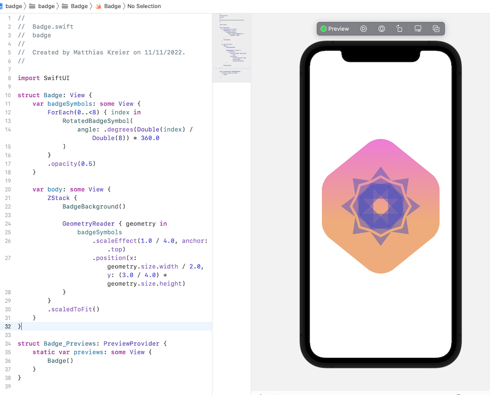

# badge

Document the SwiftUI Tutorial [Drawing Paths and Shapes](https://developer.apple.com/tutorials/swiftui/drawing-paths-and-shapes)

After some 15 commits I finally had the symbol running on xCode 13.2.1 on macOS 11.7.1

